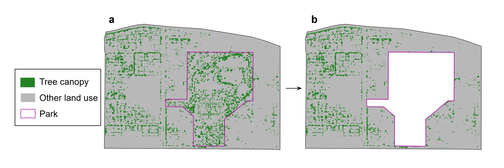
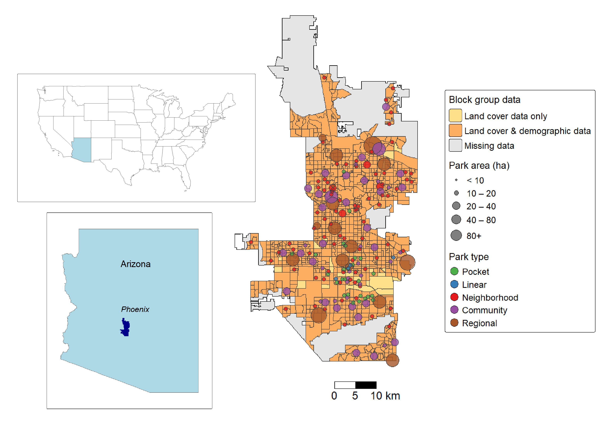
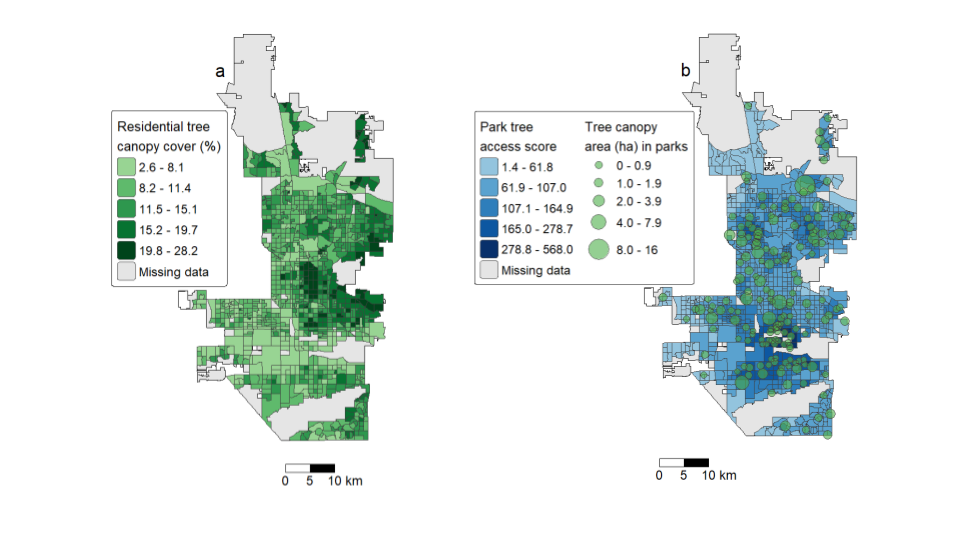
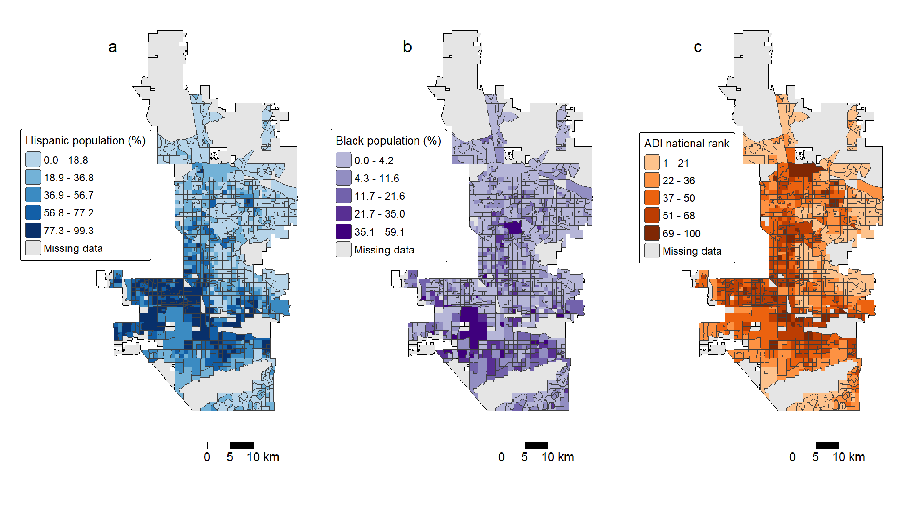
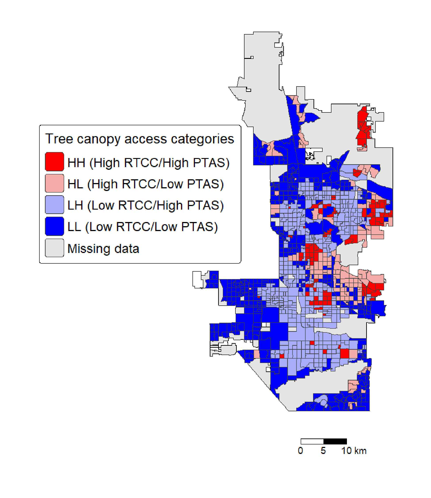

```{r}
#| label: setup
#| include: false
#| error: true

phx_bg <- readRDS(here::here("phx_bg.rds"))
parks <- readRDS(here::here("parks.rds"))
phx_bg_all <- readRDS(here::here("phx_bg_all.rds"))
phx_city_limits <- readRDS(here::here("phx_city_limits.rds"))
phx_bg_parks <- readRDS(here::here("phx_bg_parks.rds"))
park_bg_pw <- readRDS(here::here("park_bg_pw.rds"))
HH_glm <- readRDS(here::here("HH_glm.rds"))
HH_glm_sf <- readRDS(here::here("HH_glm_sf.rds"))
HL_glm <- readRDS(here::here("HL_glm.rds"))
HL_glm_sf <- readRDS(here::here("HL_glm_sf.rds"))
LH_glm <- readRDS(here::here("LH_glm.rds"))
LH_glm_sf <- readRDS(here::here("LH_glm_sf.rds"))
LL_glm <- readRDS(here::here("LL_glm.rds"))
LL_glm_sf <- readRDS(here::here("LL_glm_sf.rds"))
ols_canopy <- readRDS(here::here("ols_canopy.rds"))
ols_access_sqrt <- readRDS(here::here("ols_access_sqrt.rds"))
err_canopy <- readRDS(here::here("err_canopy.rds"))
err_access_sqrt <- readRDS(here::here("err_access_sqrt.rds"))
multinom1 <- readRDS(here::here("multinom1.rds"))
odds <- readRDS(here::here("odds.rds"))
ci <- readRDS(here::here("ci.rds"))
z_15 <- readRDS(here::here("z_15.rds"))
p_15 <- readRDS(here::here("p_15.rds"))
map_bg_parks <- readRDS(here::here("map_bg_parks.rds"))
map_access <- readRDS(here::here("map_access.rds"))
map_rtcc_ptas <- readRDS(here::here("map_rtcc_ptas.rds"))
map_demographics <- readRDS(here::here("map_demographics.rds"))

library(sf)
library(tidyverse)
library(tmap)
library(flextable)
library(stargazer)
library(modelsummary)
library(gtsummary)
library(spdep)
library(spatialreg)
library(nnet)
library(tigris)
library(cowplot)
library(kableExtra)
library(labelled)
library(gt)
library(broom)
library(purrr)
library(scales)
```

## Introduction {#sec-introduction}

Urban trees, whether in private yards, planted along streets, or in public parks, are a critical component of sustainable cities. The urban forest provides numerous ecosystem services that benefit city residents, including shade, stormwater removal, and air pollution mitigation [@fulton2025]. Tree canopy cover (TCC) — defined as the area of ground covered by tree leaves, trunks, and branches — is especially crucial in hot arid cities like Phoenix, Arizona, where ambient temperatures in full sun can feel up to 12.6 °C hotter than under tree shade [@colter2019]. Adequate shade can be a lifesaving amenity in Phoenix, which experienced 337 heat deaths in 2024 [@maricopacountydepartmentofpublichealth2024].

Like many urban amenities, tree canopy cover is often inequitably distributed across cities. Several studies have shown that residents of lower socioeconomic status tend to live in neighborhoods with lower tree canopy cover [@greene2018, @schwarz2015, @lowry2012]. Some studies in U.S. cities also report that neighborhoods with larger proportions of ethnic and racial minorities tend to have less tree canopy [@schwarz2015, @locke2021, @foster2024, @elderbrock2024, @walker2024, @zhou2013]. These patterns have been shown to hold true in Phoenix as well. Median income level has consistently been shown to have a positive correlation with TCC in the city, while the proportion of Hispanic residents within block groups is negatively correlated with TCC [@wang2024, @nesbitt2019, @nelson2021]. However, the proportion of Black residents was negatively correlated with TCC in one study [@wang2024] , while another study found no correlation between these variables [@nesbitt2019].

As a source of publicly available tree canopy cover, municipal parks could potentially act as "tree refuges" and compensate for the lack of tree cover in disadvantaged neighborhoods. While park equity studies have yielded mixed results, some have shown consistent patterns of disparities in park access in the United States. A 2016 literature review by Rigolon et al. found that neighborhoods with high White populations had the greatest park access in 18 out of 20 papers examined [@rigolon2016].

The research on disparities in access to tree canopy cover in parks is limited. A spatial analysis of urban parks across the U.S. found that parks are more common in areas with larger White populations, and these parks tend to have greater tree coverage [@winkler2024]. Fossa, et al. (2023) investigated parks within the three largest U.S. cities and found that park tree cover was positively associated with larger Black populations, larger Hispanic populations, and more socioeconomic deprivation in surrounding neighborhoods [@fossa2023]. Conversely, Elderbrock, et al. (2024) found that park tree canopy cover is equitably distributed across Portland, Oregon, regardless of the racial, ethnic, or economic makeup of the surrounding neighborhoods [@elderbrock2024].

Several researchers have analyzed disparities in Phoenix park access. Lara-Valencia (2018) found that Hispanic residents of Phoenix tend to have greater access to municipal parks due to a higher concentration of parks in the urban core [@lara-valencia2018]. However, Ibes (2015) analyzed access to public parks in Phoenix by park type and found that "green neighborhood parks" are more concentrated in neighborhoods with higher White populations while "urban core parks" are more often found in areas with lower incomes and more minority residents [@ibes2015]. Corley (2024) found no association between park acreage and minority resident proportion or poverty level at the block group level in Phoenix [@corley2024]. However, these three studies on Phoenix park access did not account for spatial autocorrelation of variables—the tendency of spatially proximate observations to be more similar than expected under random distribution—which can inflate the apparent significance of predictors when left unaddressed [@anselin1995]. Kim, et al. (2023) addressed this limitation by using spatial regression models to investigate park access in Phoenix and nearby Mesa, Arizona, and found that residents of more affluent neighborhoods had access to greater park acreage within walking distance, but there were no significant correlations between race/ethnicity and the number of parks, size of parks, or distance to the nearest park [@kim2023].

As seen in the Phoenix studies cited above, research on park accesstends to use a simple Euclidean distance metric to determine accessibility, but this method does not account for the actual distance that residents must travel to visit parks. The travel distance from a residential area to a public amenity can vary greatly from the Euclidean distance depending on the layout of the road network [@li2019]. Additionally, most studies consider "park access" to be a binary variable, where a resident has complete access to any parks within a given catchment area and no access to parks outside of the catchment area. However, this approach does not capture the reality of park visitation–people are more likely to visit nearby parks, but may still travel a greater distance to visit larger parks. For example, Kim et al. (2025) found that Phoenix residents tend to favor local parks within 1 km of their neighborhood, but the likelihood that they will travel beyond 1 km to visit larger amenity-rich parks increases as the size of the local parks decreases [@kim2025].

Traditional park access research also tends to only address the "supply" side of access by quantifying park number, area, or amenities [@kim2025, @nesbitt2019, @winkler2024] while ignoring the "demand" side, or the number of people competing for access to the parks. Other studies incorporate the population factor by simply dividing the total park area by the population within a given catchment [@lara-valencia2018]. The Gaussian two-step floating catchment area (G2SFCA) method of assessing park access addresses these shortcomings by calculating distance to an amenity based on road network rather than Euclidean distance and incorporating a park supply factor (e.g., total area or amenities), a demand factor (the population of residents with access to the parks), and a travel distance metric that weights closer parks more heavily than distant parks [@zhang_assessing_2023].

Residential tree canopy cover provided by trees in neighborhoods and commercial areas likely has a more direct impact on residents' lives than the tree canopy in public parks since residential trees shade people's homes, workplaces, and travel routes. But parks may act as tree canopy refuges, allowing people to temporarily enjoy the benefits of trees that may be lacking in their daily lives. No studies have directly investigated the relationship between residential tree canopy cover and access to park tree canopy cover, but a 2013 study by Zhou and Kim investigated neighborhood tree canopy disparities and walking-distance access to parks in six Illinois cities [@zhou2013]. They found that in four of the cities, a higher proportion of Black residents was associated with lower neighborhood tree canopy cover, but there were no disparities in access to parks. However, Zhou and Kim did not quantify the tree canopy cover within the parks.

Given the inequities in tree canopy distribution and apparent lack of inequities in park access within Phoenix, it is possible that public parks serve as tree canopy refuges that partially compensate for lack of tree cover in neighborhoods with high minority populations and low socioeconomic status. However, no research to date has tested this hypothesis. This study attempts to fill this research gap by answering the following questions:

RQ1. To what extent do racial/ethnic composition and socioeconomic deprivation predict residential (non-park) tree canopy cover across Phoenix neighborhoods?

RQ2. To what extent do racial/ethnic composition and socioeconomic deprivation predict public park tree canopy accessibility in Phoenix, and does this relationship diverge from the patterns observed for residential tree canopy?

RQ3. Do Phoenix public parks function as tree canopy refuges in areas with low residential tree canopy cover, and does this compensatory pattern hold uniformly across racial/ethnic groups and socioeconomic levels?

This research expands on existing studies of tree canopy cover in Phoenix by isolating residential tree canopy from the canopy cover provided by public park trees to avoid double counting of park trees in the analysis. It also improves on the analyses of park tree canopy access by using the G2SFCA method to capture a more realistic picture of accessibility compared to traditional Euclidean distance methods that ignore population demand and the limited availability of park entrances. And it uses spatially aware regression methods to analyze associations between tree canopy cover and demographic factors to ensure that spatial autocorrelation does not overly influence the models.

## Materials and methods {#sec-methods}

### Study area

Phoenix, Arizona is the fifth largest city in the United States, with a 2024 population of about 1.67 million within a 1,342 km^2^ area [@u.s.censusbureau2024]. Phoenix has a desert climate with mild winters and extremely hot summers. Daily maximum temperatures frequently exceed 38°C, making Phoenix the hottest large city in the country. Average annual precipitation is 195 mm, with most rainfall occurring during the winter and summer wet seasons [@fan2015].

Hispanic residents make up 43% of the city's population. The racial makeup of Phoenix is 40% White, 7% Black, 5% Asian, and 1% Native American, with 4% of the population identifying as multiracial. The median household income is \$85,246, with 12% of residents having an income below the federal poverty level of \$15,960 per person [@u.s.censusbureau2024].

### Block groups and parks

Census block groups were used as the unit of analysis in this study because this is the smallest geographic units for which detailed socioeconomic data are available. A block group is an area defined by the U.S. Census Bureau that encompasses several contiguous city blocks and usually contains between 600 and 3000 residents. Block group boundaries as of 2024 were downloaded from the United States Census Bureau using the tidycensus R package [@tidycensus].

Phoenix public park boundaries were downloaded from the City of Phoenix Open Data portal [@phoenix_gis] and manually edited using QGIS to exclude restricted access areas such as golf courses and botanical gardens. Parks established after 2021 and those missing land cover data were excluded, resulting in 177 public parks in the final dataset. Private planned community parks were excluded from the analysis as they are often inaccessible to non-residents [@cityofphoenixb].

The City of Phoenix Parks and Recreation Department classifies parks into five types based on their size and amenities. Each park type has a service area radius that represents the recommended distance from a Phoenix residence to the nearest park of a given type [@cityofphoenixparksandrecreationdepartment]. Park type characteristics are summarized in @tbl-park-types.

```{r}
#| label: tbl-park-types
#| tbl-cap: "Typical amenities, sizes, and service area radius of Phoenix public park types"

park_types <- data.frame(
  `Park type` = c("Pocket", "Linear", "Neighborhood", "Community", "Regional"),
  `Typical amenities` = c(
    "Playground; small open area; picnic areas",
    "Linear open space; walking/biking path; fitness equipment; picnic areas",
    "Open space; playground; sports fields; fitness equipment; picnic areas",
    "Amenities found in neighborhood parks, plus: swimming pool; recreational center; dog park; skate plaza; pond",
    "Amenities found in community parks, plus: community/senior center; sports complex and concessions; skate park"
  ),
  `n` = c("26", "4", "84", "47", "16"),
  `Size (ha)` = c("<0.8", "Various", "0.8-11.9", "12-20", ">20"),
  `Service area radius (km)` = c("0.8", "0.8", "1.6", "4.8", "8.0"),
  check.names = FALSE
) 

park_types |> 
  gt() |> 
  cols_align("center",
             columns = 3:4) |> 
  tab_style(
    style = cell_text(style = "italic"),
    locations = cells_column_labels(columns = "n")
  )

```

### Tree canopy cover {#sec-tree-canopy}

Tree canopy data were extracted from a 2021 land cover raster file created by the University of Vermont Spatial Analysis Lab and provided by American Forests [@maricopa2021]. The imagery has a spatial resolution of 0.3 m and includes most of Phoenix except for large undeveloped desert preserves and some urban land on the periphery of the city. A total of `r nrow(phx_bg_all)` block groups had tree canopy cover data available. The percentage of total tree canopy cover (TTCC) per block group was calculated using the zonal histogram tool in QGIS. TTCC represents the total amount of tree canopy cover within a block group, including street trees and those in private yards, businesses, and parks. I then clipped public park polygons from the land cover raster and calculated the percentage of tree cover on the non-public park land within block groups, known as the residential tree canopy cover (RTCC). @fig-tree-cover shows the effect of trees within a public park on the tree canopy cover within a block group. Although RTCC includes trees within non-residential areas such as schools, churches, and parking lots, they are considered "residential" in this study since they are not located in public parks, and they have a more direct impact on residents' daily lives.

{#fig-tree-cover fig-alt="Map showing a block group with 11.7% tree canopy cover. The tree canopy reduces to 8.2% when a large park is clipped out of the block group."}

I performed the Mann-Whitney *U* test to determine whether TTCC within all block groups in the city is affected by the presence of public parks. The median TTCC value of the `r nrow(phx_bg_parks)` block groups with parks was compared to the TTCC value of the `r nrow(filter(phx_bg_all, has_park == FALSE))` block groups without parks, and the *U* statistic was calculated.

I performed the Wilcoxon signed-rank test on the block groups that contain public parks to determine whether the parks contribute to the total tree canopy cover within those block groups.

### Demographic factors {#sec-demographic}

I sourced the total population and race/ethnicity data at the block group level from the 2024 American Community Survey (ACS) 5-year estimate [@uscensusbureau] using the tidycensus R package. These factors were used to calculate the percentage of Black and Hispanic residents per block group. Population estimates from the 2024 ACS 5-year estimate were also downloaded for individual Census blocks to be used for calculating population-weighted block group centroids.

Research on disparities in tree canopy cover tend to use median income or median household income as an explanatory variable to capture the socioeconomic status of residents \[ @lara-valencia2018, @zhou2013\]. Some studies also include variables related to housing and education [@zhou2013]. However, socioeconomic status is multifaceted and not easily summed up by individual factors; therefore, it is common in equity research to use a validated composite measure of social vulnerability to better represent the nuances of economic and social deprivation. One such metric is the area deprivation index (ADI) developed by Singh in 2003 [@singh2003]. The ADI incorporates 17 U.S. Census indicators of income, education, employment, and housing quality at the census block group level (600-3000 people). The raw ADI score of a block group is compared against all other block groups in the nation and ranked on a percentile scale from 1-100, where 1 indicates the lowest level of disadvantage and 100 indicates the highest disadvantage. [@rollings2023].

I acquired the ADI national ranks of Phoenix block groups from the University of Wisconsin School of Medicine Public Health [-@universityofwisconsinschoolofmedicinepublichealth2023]. Block groups containing predominantly group housing (college dormitories or jails) do not have ADI data available, so they were excluded from the analysis. The resulting dataset contained `r nrow(phx_bg)` block groups used in the demographic analysis. @fig-bg-parks shows the locations of block groups with land cover and/or demographic data available and the types and sizes of public parks within these block groups.

{#fig-bg-parks fig-alt="A map shows that most block groups in Phoenix have land cover and demographic data available; some only have land cover data; parks of various sizes and types are scattered throughout the city"}

### Spatial access to park tree canopy cover {#sec-methods-spatial}

I used the Gaussian two-step floating catchment area (G2SFCA) method to determine Phoenix residents' spatial access to tree canopy cover in public parks. This method accounts for both the supply of public amenities and demand on those amenities when calculating accessibility. In previous studies of green space equity, park size and amenities have often been used as the supply term (CITE). The population of areas surrounding an amenity represents the demand on the amenity. More people living near a park leads to greater competition for the park's amenities, including tree canopy cover.

Park tree canopy area in hectares (PTCA) was used as the supply term and was calculated by multiplying the percent tree canopy cover of a park by its total area (@tbl-parks). Since PTCA values are affected by both park size and percent tree canopy cover, residents living near several small tree-dense parks may have access to more tree canopy than residents near a single large park with scant tree cover. @fig-park-types-tree-area shows the range of tree canopy area by park type and for all parks combined.

```{r}
#| label: tbl-parks  
#| tbl-cap: "Total park area and park tree canopy cover area in Phoenix public parks"    
 
# Create gt table of descriptive statistics
datasummary((`Park area (ha)` = area_ha) + 
              (`Park tree canopy cover (%)` = tree_pct) ~ 
              Mean + SD + Median + Min + Max, 
            data = st_drop_geometry(parks),
            output = "gt"
) |> 
  tab_footnote(footnote = md(paste0("*N* = ", nrow(parks), " parks"))) |> 
  tab_style(
    style = cell_text(align = "left"),
    locations = list(cells_footnotes())
  )
```

```{r}
#| label: fig-park-types-tree-area
#| fig-cap: "Tree area (ha) by park type"

parks_all <- parks |> 
  mutate(park_type = "All parks")

parks_plot <- bind_rows(parks,
                        parks_all) |> 
  mutate(park_type = factor(
    park_type,
    levels = c("Pocket",
               "Linear",
               "Neighborhood",
               "Community",
               "Regional",
               "All parks")
  ))

ggplot(parks_plot, aes(x = park_type, 
                       y = tree_area,
                       fill = park_type)) +
  geom_boxplot() +
  scale_fill_manual(values = park_colors) +
  scale_y_continuous(trans = pseudo_log_trans(base = 10, sigma = 0.01), 
                     breaks = c(0, 0.1, 1, 10),
                     labels = scales::label_number()) +
  labs(x = "Park type", y = "Tree canopy area (ha, log scale)") +
  theme_minimal() +
  theme(legend.position = "none")
```

An accurate assessment of park access using the G2SFCA method depends on the choice of supply and demand origin points used to determine travel distance from residents to parks. Census block group centroids are often used as demand origin points in spatial access research because they represent the "average" location of residents within a reasonably small area. However, population-weighted block group centroids are less likely to underestimate accessibility than geographic centroids [@kim2024]. For example, the geographic centroid of a large block group with housing concentrated in one corner is likely to be located far from areas where most people live, leading to a suboptimal estimate of the travel distance to a public park.

Likewise, the geographic centroid of a park is commonly used as the supply origin point, but this choice can provide an inaccurate picture of park access, especially in large parks or long linear parks where the centroid is far from the entrances. Residents also may not be able to access parks at any point along the boundary but are instead limited to a small number of entrances. Using park entrances rather than centroids as the supply origin points in a G2SFCA analysis overcomes these limitations and better represents how residents access public parks using various modes of transportation [@zhang_assessing_2023].

The first step in the G2SFCA method is to compute the ratio of park tree canopy area to the surrounding block group population at each park location. The population-weighted centroid of block groups was used as the population location ($k$) in calculating the distance between block groups and parks. This point represents the mean location of residents within the block group. Populations at each block group location $k$ are weighted using a Gaussian function. This ratio is calculated as:

$$R_j = \frac{S_j}{\sum_{k \in {d_{kj} \leq d_0}} G(d_{kj}, d_0)P_k},$$ {#eq-sd-ratio}

where $P_k$ Pk is the population at block group $k$ whose population-weighted centroid lies within the catchment (i.e., $d_{kj} \leq d_0$) of a park at location $j$; $d_{kj}$ is the travel distance between block group $k$ and park $j$; $S_j$ is the supply capability of park $j$, i.e., the tree canopy area in hectares; $G$ is the friction-of-distance, calculated below:

$$G(d_{kj}, d_0) = 
\begin{cases}
\dfrac{e^{-(1/2) \times (d_{kj}/d_0)^2} - e^{-(1/2)}}{1 - e^{-(1/2)}}, & \text{if } d_{kj} \leq d_0 \\[10pt]
0, & \text{if } d_{kj} > d_0
\end{cases} .$$ {#eq-gaussian}

The second step in G2SFCA is to search all parks $l$ within the threshold distance $d_0$ from block group $i$, thus creating the catchment for the population at $i$. Each $R$ is discounted using the Gaussian function $G$. The discounted $R$ values within the catchment area of $i$ are summed to obtain the spatial accessibility of park tree canopy area at block group $i$ as follows:

$$A_i = \sum_{l \in \ d_{il} \leq d_0} G (d_{il}, d_0)R_l,$$ {#eq-access}

where $l$ denotes all parks within the catchment of block group $i$, and all other notations are the same as in @eq-sd-ratio. The park tree canopy accessibility score ($A_i$) represents the amount of park tree canopy cover (in hectares) available to each resident in a given block group. Raw accessibility scores are very small values and thus were re-scaled by a factor of 1,000,000 for reporting purposes; the re-scaled values are hereafter referred to as park tree access scores (PTAS).

Public park access studies often use the park centroid as the destination point (CITE). However, this can bias the results against large parks since users may have to walk long distances from a park entrance to the centroid. Parks may also have multiple points of entry that are separated by significant distances [@zhang2023a]. This study used park entrances, determined by visual examination using QGIS, as destination locations for parks larger than 2 ha. For smaller parks, the centroid was used since travel distance would be minimally affected by the access point location.

Travel distance ($d_{kj}$) from block group centroids ($k$) to park entrances ($j$) was computed using the driving profile in the osrm R package [@osrm]. This method uses the Open Source Routing Machine to identify the shortest driving path between any two points based on the OpenStreetMap road network. A distance matrix of all block group population-weighted centroids to all park entrances was created and then limited to the distance from a block group to only the nearest entrance within any given park.

Previous studies on park access tend to rely on arbitrary catchment sizes, typically in the range of 0.5 to 1 km, based on the assumption that people will only walk a short distance to visit parks (CITE). However, (CITE) have shown that Phoenix residents are willing to travel farther to access larger parks with more amenities (CITE). Therefore, rather than rely on a single catchment size for all parks, catchment size ($d_0$) was determined by the service area radius assigned to each park type by the City of Phoenix (pocket, linear, neighborhood, community, or regional) [@cityofphoenixa]. Pocket and linear parks were assigned a threshold of 0.8 km (0.5 mi), neighborhood parks 1.6 km (1 mi), community parks 4.8 km (3 mi), and regional parks 8.0 km (5 mi). This aligns the park catchment values with the park accessibility goals of the City of Phoenix.

Residents from nearby cities may visit Phoenix parks, thus diluting the quantity of park tree canopy available to Phoenix residents. Therefore, the populations of `r nrow(park_bg_pw) - nrow(phx_bg_all)` block groups from surrounding cities that lie within park catchment areas were included in the calculation of the supply/demand ratios ($R_j$ and $R_l$).

### Regression analysis of tree canopy cover disparities {#sec-methods-regress}

The first step in evaluating demographic disparities in block group-level tree canopy cover was to apply ordinary least squares (OLS) regression models using RTCC and PTAS as the outcome variables and percent Hispanic population, percent Black population, and ADI national percentile rank as the predictor variables. An initial OLS model using the untransformed PTAS score showed non-normal residuals (Shapiro-Wilk *W* = 0.843, *p* \< .001) with visible right skew in a Q-Q plot. A square root transformation was applied to PTAS and the model re-estimated; residual normality improved (*W* = 0.955) but remained significantly non-normal (*p* \< .001).

Demographic and environmental variables often exhibit spatial autocorrelation, meaning the residuals in a given block group are likely to be similar to their surrounding block groups. The presence of spatial autocorrelation violates the assumption of independent residuals required for for OLS regression, necessitating the use of spatially aware regression models. The global Moran's *I* index was calculated to measure the overall spatial autocorrelation of the residuals of both OLS regression models using the following formula:

$$I = \frac{N}{S_0} \frac {\sum_{i=1}^N \sum_{j=1}^N w_{ij}(x_i-\bar x) (x_j-\bar x)} {\sum_{i=1}^N (x_i-\bar x)^2},$$ {#eq-morans}

where $N$ is the number of block groups indexed by $i$ and $j$, $x$ is the variable of interest (i.e., OLS residuals), $\bar{x}$ is the mean of $x$*,* $w_{ij}$ is a spatial weights matrix that represents the degree of spatial proximity between block groups $i$ and $j$. The distance matrix was calculated based on the eight nearest neighbors of each block group. This method allowed for all block groups to be included in the computation, resulting in no isolated "islands" of block groups. A Monte Carlo simulation with 999 iterations was used, and the *p*-value was set at 0.01 to evaluate the significance of the global Moran's *I* index. The value of Moran's *I* ranges from -1 to 1; positive values indicate clustering, negative values indicate dispersion, and 0 indicates a random distribution of residuals.

Since spatial autocorrelation was present in the residuals of the OLS models for both dependent variables, spatial regression models were warranted. Lagrange Multiplier (LM) tests were used to determine the appropriate spatial regression specification for each outcome, following the decision rule recommended by Anselin and Serge [@anselin1991]: if the robust LM error statistic is significant and the robust LM lag statistic is not, a spatial error model is selected; if robust LM lag is significant and robust LM error is not, a spatial lag model is selected. LM tests indicated that a spatial error specification was appropriate for both RTCC and PTAS (see @sec-results).

In a spatial error model, spatial dependence is captured in the error term rather than the outcome itself. This specification is appropriate when neighboring block groups have similar residuals due to unmeasured place-based factors that cluster spatially and affect tree canopy cover, such as housing age or homeowners association planting guidelines. By modeling this spatial structure as an error term, the spatial error model isolates the independent effects of racial/ethnic composition and socioeconomic disadvantage on tree canopy outcomes. The spatial error model takes the following form:

$$y = X \beta + u,$$ {#eq-sem}

where $y$ is the outcome (RTCC or PTAS), $X$ represents the predictor variables (percent Hispanic population, percent Black population, and ADI rank), $\beta$ represents the coefficients, and $u$ is an error term modeled as:

$$u = \lambda Wu + \epsilon,$$ {#eq-error}

where $\lambda$ is the spatial error coefficient, $Wu$ is the weighted average of neighboring errors based on a spatial weights matrix of the eight nearest neighbors, and $\epsilon$ is a random independent error term.

### Compensatory tree canopy access (need better title) {#sec-methods-multinom}

Block groups were classified according to residential tree canopy cover and park tree access score. Those with an RTCC value of 15% or higher were classified as high RTCC category, following American Forests' recommendation that desert cities should maintain a 15% tree canopy cover to achieve tree equity [@cityofphoenix]; the remainder were classified as low RTCC. In the absence of comparable policy guidelines for park tree access, block groups with a PTAS at or above the median were classified as high PTAS, and those below the median as low PTAS. The two factors were then combined to create four tree canopy access categories: a) high RTCC/high PTAC (HH), b) high RTCC/low PTAS (HL), c) low RTCC/high PTAS (LH), or d) low RTCC/low PTAS (LL).

Multinomial logistic regression was used to examine whether the percent Hispanic population, percent Black population, or ADI rank predicted a block group's membership in each tree canopy access category relative to the high RTCC/high PTAS condition (HH). Given that spatial autocorrelation was detected in the residuals of both the RTCC and PTAS regression residuals, it was expected that the residuals of the tree access category logistic regression model might exhibit similar spatial dependence. However, global Moran's *I* cannot be calculated directly on the residuals of a multinomial logistic model, since the outcome comprises four unordered categories rather than a single continuous or binary residual vector. To address this, each tree canopy access category (HH, HL, LH, LL) was recast as a binary outcome (one-vs-rest) and modeled separately via logistic regression on the same three demographic predictors. Global Moran's *I* was then calculated on the residuals of each binary model to test for spatial autocorrelation.

Significant spatial autocorrelation was detected on the residuals of all four binary regression models (see @sec-results), so the Moran eigenvector spatial filtering approach was used to incorporate spatial predictors into the models [@griffith2006]. This approach decomposes a spatial weights matrix into orthogonal eigenvectors, each representing a distinct spatial pattern at a different scale. These eigenvectors are incorporated into the regression model as additional predictors, thereby absorbing the spatial signal that would otherwise be part of the model's error term. Eigenvector selection was implemented using the spatialreg R package [@spatialreg], using the eight-nearest-neighbors matrix used previously. Each eigenvector was tested iteratively, and those that significantly reduced Moran's *I* (α = 0.08) were retained. The selected eigenvectors were added as additional covariates to each binary logistic model, and global Moran's *I* was recalculated on the resulting residuals to assess the degree to which spatial autocorrelation had been reduced.

## Results {#sec-results}

### Impact of public parks on tree canopy cover {#sec-res-impact}

```{r}
#| label: ttcc-median
#| include: false

# Compute median values of block group TTCC with and without parks
ttcc_med <- formatC(median(phx_bg_parks$pct_tree_wo_parks), format = "f", digits = 2)
ptcc_med <- formatC(median(phx_bg_parks$pct_tree_parks), format = "f", digits = 2)

ttcc_med_parks <- phx_bg_all |> 
  filter(has_park) |>
  st_drop_geometry() |>
  summarize(median = median(pct_tree_parks, na.rm = TRUE)) |>
  pull(median) |>
  formatC(format = "f", digits = 2)

ttcc_med_wo_parks <- phx_bg_all |> 
  filter(!has_park) |>
  st_drop_geometry() |>
  summarize(median = median(pct_tree_parks, na.rm = TRUE)) |>
  pull(median) |>
  formatC(format = "f", digits = 2)

```

```{r}
#| label: mann-wilcoxon
#| include: false

# Compute Mann's U statistic for median TTCC with and without parks
mann <- wilcox.test(pct_tree_parks ~ has_park, data = phx_bg_all)

mann_u <- formatC(mann$statistic, format = "f", digits = 0)
mann_p <- ifelse(mann$p.value < 0.001, "0.001",
                 formatC(mann$p.value, format = "f", digits = 3))

# Compute Wilcoxon's V statistic for median RTCC with and without parks
wilcox <- wilcox.test(phx_bg_parks$pct_tree_parks, phx_bg_parks$pct_tree_wo_parks, paired = T)

wilcox_v <- formatC(wilcox$statistic, format = "f", digits = 0)
wilcox_p <- ifelse(wilcox$p.value < 0.001, "0.001",
                   formatC(wilcox$p.value, format = "f", digits = 3))

# Calculate number of block groups with negative diff between TTCC and RTCC
negative_diff <- phx_bg_parks |> 
  st_drop_geometry() |> 
  mutate(diff = pct_tree_parks - pct_tree_wo_parks) |> 
  summarize(
    n_neg = sum(diff < 0, na.rm = TRUE),
    pct_neg = round(mean(diff < 0, na.rm = TRUE) * 100, 1)
  )
```

Percent total tree canopy cover (TTCC) is the amount of tree canopy cover in a block group including the tree cover provided by public parks. Across the entire city, the `r sum(phx_bg_all$has_park)` block groups that contain parks have a median TTCC of `r ttcc_med_parks`, while the `r nrow(filter(phx_bg_all, has_park == FALSE))` block groups without parks have a median TTCC of `r ttcc_med_wo_parks`. This difference is non-significant (Mann-Whitney *U* = `r mann_u`, *p* = `r mann_p`), suggesting that parks are evenly distributed across the canopy spectrum rather than concentrated in already-green neighborhoods.

Percent residential tree canopy cover (RTCC) is the tree cover in a block group excluding the tree cover provided by public parks. TTCC and RTCC were compared in the `r nrow(phx_bg_parks)` block groups that contain parks to determine whether the parks significantly contribute to block group-level tree canopy cover in Phoenix. The median TTCC was `r ttcc_med`%, while RTCC was higher at `r ptcc_med`% (@tbl-ttcc-rtcc). This difference was statistically significant (Wilcoxon signed-rank test, *V* = `r wilcox_v`, *p* \< `r wilcox_p`), confirming that parks meaningfully contribute to tree canopy cover when they are present in a neighborhood. Although the presence of parks had an overall positive impact on TTCC, `r negative_diff$n_neg` (`r negative_diff$pct_neg`%) of the park-containing block groups saw a reduction in TTCC compared to RTCC. This occurs when a park with low tree canopy cover is located in a block group with a higher canopy cover, thus reducing the neighborhood's total tree canopy percentage.

```{r}
#| label: tbl-ttcc-rtcc
#| tbl-cap: "Total tree canopy cover (TTCC) and residential tree canopy cover (RTCC) in block groups that contain parks"

ttcc_rtcc_table <- phx_bg_parks |> 
  st_drop_geometry() |> 
  mutate(diff = pct_tree_parks - pct_tree_wo_parks) |> 
  select(pct_tree_parks, pct_tree_wo_parks, diff) |> 
  pivot_longer(
    cols = everything(),
    names_to = "variable",
    values_to = "value"
  ) |> 
  mutate(
    variable = factor(
      variable,
      levels = c("pct_tree_parks",
                 "pct_tree_wo_parks",
                 "diff")
    )
  ) |> 
  group_by(variable) |> 
  summarize(
    Mean = mean(value, na.rm = TRUE),
    SD = sd(value, na.rm = TRUE),
    Median = median(value, na.rm = TRUE),
    Min = min(value, na.rm = TRUE),
    Max = max(value, na.rm = TRUE)
  ) |> 
  mutate(
    variable = case_match(
      variable,
      "pct_tree_parks" ~ "Total tree canopy cover (%)",
      "pct_tree_wo_parks" ~ "Residential tree canopy cover (%)",
      "diff" ~ "TTCC - RTCC (%)"
    )
  )

ttcc_rtcc_table |> 
  gt(rowname_col = "variable") |> 
  cols_label(variable = "") |> 
  fmt_number(columns = c(Mean, SD, Median, Min, Max), decimals = 2)|> 
  tab_footnote(footnote = "TTCC: Total tree canopy cover; RTCC: Residential tree canopy cover", 
               locations = cells_stub(rows = "TTCC - RTCC (%)")) |> 
    tab_footnote(footnote = md("*N* = 176 block groups containing parks")) |> 
  tab_style(
    style = cell_text(align = "left"),
    locations = list(cells_footnotes()))
```

### Regression analysis {#sec-res-regress}

@tbl-desc-stats presents descriptive statistics for the block group characteristics and outcome variables (RTCC and PTAS) used in the regression analyses. Block group population is included for reference, but it was not used as a predictor variable. @fig-rtcc-ptas-map illustrates the RTCC and PTAS values per block group, along with the area of each park covered by tree canopy. Maps of the three predictor variables (percent Hispanic population, percent Black population, and ADI rank) are depicted in @fig-bg-demographics.

```{r}
#| label: tbl-desc-stats
#| tbl-cap: "Descriptive statistics of the dataset"

# Create descriptive statistics table
desc_table <- phx_bg |> 
  sf::st_drop_geometry() |> 
  summarize(
    across(
      c(population, pct_hispanic, pct_black, adi_rank, pct_tree, tree_access),
      list(
        Mean   = ~mean(.x, na.rm = TRUE),
        SD     = ~sd(.x, na.rm = TRUE),
        Median = ~median(.x, na.rm = TRUE),
        Min    = ~min(.x, na.rm = TRUE),
        Max    = ~max(.x, na.rm = TRUE)
      ),
      .names = "{.col}__{.fn}"
    )
  ) |> 
  tidyr::pivot_longer(
    everything(),
    names_to = c("Variable", "Statistic"),
    names_sep = "__"
  ) |> 
  tidyr::pivot_wider(names_from = Statistic, values_from = value) |> 
  mutate(
    Variable = case_match(Variable,
                          "population"   ~ "Total population",
                          "pct_hispanic" ~ "Hispanic population (%)",
                          "pct_black"    ~ "Black population (%)",
                          "adi_rank"     ~ "ADI rank",
                          "pct_tree"     ~ "Residential tree canopy cover (%)",
                          "tree_access"  ~ "Park tree access score"
    )
  ) |> 
  # Preserve intended row order rather than alphabetical
  arrange(match(Variable, c("Total population", "Hispanic population (%)",
                            "Black population (%)", "ADI rank",
                            "Residential tree canopy cover (%)",
                            "Park tree access score")))

desc_table |> 
  gt() |> 
  tab_row_group(
    label = md("*Block group characteristics*"),
    rows = Variable %in% c("Total population", 
                           "Hispanic population (%)", 
                           "Black population (%)",
                           "ADI rank")
  ) |> 
  tab_row_group(
    label = md("*Outcome variables*"),
    rows = Variable %in% c("Residential tree canopy cover (%)",
                           "Park tree canopy access score")
  ) |> 
  row_group_order(groups = c("*Block group characteristics*",
                             "*Outcome variables*")) |> 
  fmt_number(columns = c(Mean, SD, Median, Min, Max), 
             rows = Variable %in% c("Total population", "ADI rank"),
             decimals = 0) |> 
  fmt_number(columns = c(Mean, SD, Median, Min, Max), 
             rows = Variable %in% c("Hispanic population (%)", 
                                    "Black population (%)",
                                    "Residential tree canopy cover (%)",
                                    "Park tree access score"),
             decimals = 1) |>
  cols_label(Variable = "") |> 
  tab_footnote(footnote = md("*N* = 988 block groups")) |> 
  tab_options(row_group.padding = px(10)) |> 
  tab_style(
    style = cell_text(align = "left"),
    locations = list(cells_footnotes())
  )
```

{#fig-rtcc-ptas-map fig-alt="Residential tree canopy cover is highest in the central and northeastern parts of Phoenix. Park tree access score is highest in the central part."}

{#fig-bg-demographics fig-alt="Hispanic population is highest in the southwest of Phoenix; Black population is highest in the southern part with a small pocket in the north; ADI rank is highest in the western part with a high cluster in the north"}

Based on the OLS model, percent Hispanic population, percent Black population, and ADI rank were all negatively associated with RTCC (*p* \< 0.001; see @tbl-regress). For every 1% increase in the Hispanic population, residential tree canopy cover within a block group is expected to decrease by 3.5%; a 1% increase in the population of Black residents is associated with a 7.3% decrease in RTCC; and a 1-point increase in the ADI rank is associated with an 8.5% decrease in RTCC.

In the OLS model, the percentage of Hispanic residents in a block group is not significantly associated with the square root of PTAS, but there was a significant positive association between the square root of PTAS and both Black resident percentage (*p* \< 0.05) and ADI rank (*p* \< 0.001; see @tbl-regress). However, with an *R²* of only 0.073, these demographic factors explain very little of the variation in park tree access.

```{r}
#| label: global-morans
#| include: false

# Create weight matrix
phx_bg_pw <- readRDS("phx_bg_pw.rds")
nb8 <- knn2nb(knearneigh(phx_bg_pw, k = 8))
nbw8 <- nb2listw(nb8, style = "W")

# Global Moran's I for tree canopy
moran_canopy <- moran.mc(phx_bg$ols_canopy_resid, nbw8, nsim = 999)

moran_c_I <- formatC(moran_canopy$statistic, format = "f", digits = 3)

# Global Moran's I for park tree access
moran_access <- moran.mc(phx_bg$ols_access_resid, nbw8, nsim = 999)

moran_a_I <- formatC(moran_access$statistic, format = "f", digits = 3)

```

Global Moran's *I* was significant (*p* \< 0.001) for both the RTCC and PTAS residuals from the OLS models. The RTCC index was `r moran_c_I`, indicating moderate spatial clustering of residential tree canopy values, and the PTAS index was `r moran_a_I`, indicating strong spatial clustering of park tree access scores.

Spatial error model results are presented in @tbl-regress along with OLS estimates for comparison. Reduced Akaike Information Criterion (AIC) values indicate that the spatial error models perform better than OLS models for both RTCC and PTAS (square-root transformed). The lambda ($\lambda$) term indicates how neighboring observations influence one another's errors. The positive $\lambda$ in both spatial error models indicates that unmeasured error in one block group significantly impacts the errors in adjoining block groups for both RTCC and √PTAS. The substantially higher lambda in the √PTAS models ($\lambda$ = 0.731) relative to the RTCC models ($\lambda$ = 0.462) likely reflects the spatial smoothing inherent to the G2SFCA construction of PTAS, in which overlapping park catchments induce autocorrelation among neighboring block groups regardless of demographic makeup.

Similar to the OLS model, all three predictor variables are negatively correlated with RTCC in the spatial error model, indicating that block groups with larger Hispanic populations, larger Black populations, or higher ADI rank are more likely to have lower residential tree canopy cover even after spatial autocorrelation is taken into account. The pseudo-*R*²value of 0.417 for the spatial error model fit is consistent with a reasonably strong model fit for RTCC.

The pseudo-*R*²value of 0.383 for the square-root transformed PTAS spatial error model is substantially higher than the OLS *R²* (0.073). Given the differing basis of these two statistics, this shift should be interpreted cautiously, but it is consistent with the much larger increase in $\lambda$ for PTAS relative to RTCC. Both results likely reflect the spatial structure inherent to the overlapping catchment areas in the G2SFCA method. This model is consistent with the OLS results finding no significant association between park tree canopy access and Hispanic population percent. Accounting for spatial structure reduces the percent Black population coefficient in the √PTAS from 0.027 (*p* \< 0.01) in the OLS model to 0.019 (*p* \< 0.05) in the spatial error model. This finding is consistent with a portion of the OLS-based association reflecting shared spatial structure in park tree canopy cover rather than a completely demographic effect.

The significant positive relationship between √PTAS and ADI rank in the spatial error model again indicates that the park tree access score increases as socioeconomic status decreases. This relationship remained stable in both magnitude and significance after accounting for spatial autocorrelation, supporting ADI as the more robust predictor of access to park tree canopy in Phoenix.

```{r}
#| label: tbl-regress
#| tbl-cap: "Results of OLS and spatial error regression models for RTCC and PTAS"

# Extract pseudo-r2 from spatial error models
sum_err_canopy <- summary(err_canopy, Nagelkerke = TRUE)
sum_err_access_sqrt <- summary(err_access_sqrt, Nagelkerke = TRUE)

glance_custom.Sarlm <- function(x, ...) {
  s <- summary(x, Nagelkerke = TRUE)
  data.frame(nagelkerke = s$NK)
}

# Format R2 label
gof_map <- tribble(~raw, ~clean, ~fmt,
                   "aic", "AIC", 1,
                   "r.squared", "R²", 3,
                   "nagelkerke", "Pseudo-R²", 3)

# Create table
regress_table <- modelsummary(list("OLS" = ols_canopy,
                  "Spatial error" = err_canopy,
                  "OLS" = ols_access_sqrt,
                  "Spatial error" = err_access_sqrt
                  ),
             coef_rename = c(
               "pct_hispanic" = "Hispanic population (%)",
               "pct_black" = "Black population (%)",
               "adi_rank" = "ADI rank"),
             estimate = "{estimate}{stars}",
             statistic = NULL,
             stars = c("†" = .1, "*" = .05, "**" = .01, "***" = .001),
             gof_map = gof_map,
             output = "gt") |> 
  cols_align_decimal(columns = 2:5) |> 
  tab_spanner(label = "RTCC models",
              columns = 2:3) |> 
  tab_spanner(label = "√PTAS models",
              columns = 4:5) |> 
  tab_footnote(footnote = md(paste0("&#42; *p* < 0.05, ** *p* < 0.01, *** *p* < 0.001")))|> 
  tab_footnote(footnote = md(paste0("*N* = ", nrow(phx_bg)))) |> 
  tab_footnote(footnote = "RTCC: Residential tree canopy cover; √PTAS: Park tree access score (square-root transformed)", 
               locations = cells_column_spanners(spanners = c(
                 "RTCC models", "√PTAS models"
               ))) |> 
  tab_footnote(
    footnote = "R² is reported for OLS models; Nagelkerke pseudo-R² is reported for spatial error models",
    locations = cells_column_labels(columns = c(2, 4))
  ) |> 
    tab_style(
    style = cell_text(align = "left"),
    locations = list(cells_footnotes())
  )

regress_table
```

### Demographic inequities in tree canopy access {#sec-res-demographic}

Block groups were organized into one of four tree canopy access categories based on their RTCC and PTAS values (@tbl-canopy-access). Of the 988 total block groups, 211 met the high-RTCC threshold and 777 fell below the threshold; PTAS values were split evenly around the median (*n* = 494 high and 494 low). The spatial distribution of each category is illustrated in @fig-canopy-access-map. The least common category is HH, or neighborhoods with both abundant residential tree canopy and higher than average access to park tree canopy. These block groups are mostly confined to isolated pockets in the northeastern part of Phoenix. Block groups in the HL category have abundant residential tree canopy, but lower than average access to park trees. The most common category is LH, representing low-residential canopy neighborhoods where public parks provide a tree canopy refuge to the residents. They are located mostly in the center and northern portions of the city. The remaining block groups belong to the LL category, or tree canopy deserts, lacking both residential tree canopy cover and access to public park tree canopy. They tend to be found on the periphery of the city.

```{r}
#| label: tbl-canopy-access
#| message: false
#| warning: false
#| tbl-cap: Tree canopy access categories

# Build data frame
canopy_access <- data.frame(
  category = c("HH", "HL", "LH", "LL"),
  rule = c("High RTCC + High PTAS", 
           "High RTCC + Low PTAS", 
           "Low RTCC + High PTAS",
           "Low RTCC + Low PTAS"),
  desc = c("Abundant residential and park tree canopy",
           "Abundant residential tree canopy, but low park tree access",
           "Low residential tree canopy, but parks provide tree canopy refuge",
           "Residential and park tree canopy desert"),
  bg_pct = c("89 (9.0)", "122 (12.3)", "404 (40.9)", "373 (37.8)")
)

# Create gt table
canopy_access |> 
  gt() |> 
  cols_label(
    category = "Category",
    rule = "Rule",
    desc = "Description",
    bg_pct = md("*n* Block groups (%)"),
  ) |> 
  tab_footnote(footnote = md(paste0("*N* = 988 total block groups"))) |> 
  tab_style(
    style = cell_text(align = "left"),
    locations = list(cells_footnotes())
  )
```

{#fig-canopy-access-map fig-alt="HH block groups are mostly in the northeast of Phoenix; HL block groups are in the eastern part; LH are mostly in the central part; LL are mostly on the edges of the city"}

The multinomial logistic regression model estimates the odds that a particular demographic factor (Hispanic population, Black population, or ADI rank) predicts whether a block group belongs to either the HL, LH, or LL tree access category rather than the baseline HH category (@tbl-multinom). The results show that block groups are equally likely to be in the HL category compared to the HH category, regardless of the demographic makeup of the block group. In other words, neighborhoods with high residential tree canopy cover and high park tree canopy access are not demographically distinct from those with high residential canopy and low park tree access.

All three demographic factors were significantly associated with membership in the LH category (*p*\<0.05). For every 1% increase in the Hispanic population, there is a 2% increase in the odds that a block group belongs to the LH category vs. the HH category. A 1% increase in Black population is associated with a 5% increase in the odds of belonging to the LH category. A one-point increase in ADI national percentile rank is associated with an 8% increase in the odds of being in the LH category.

For the LL tree access category, only ADI rank is significant (*p*\<0.001). For every one-point increase in ADI rank, there is a 6% increase in the odds that a block group belongs to this category compared to the HH category.

Higher ADI rank was associated with greater odds of belonging to both low RTCC categories, LH and LL, relative to HH. This supports the previous finding that low socioeconomic status is linked to reduced residential tree canopy cover in Phoenix. But there is no clear relationship between the socioeconomic level of a low-RTCC block group and its likelihood of having greater access to public park tree canopy cover.

The higher odds of a block group with a larger Black or Hispanic population belonging to the LH category suggests that these neighborhoods are more likely to have parks that act as tree canopy refuges, providing higher park tree canopy access despite having low residential tree canopy cover.

```{r}
#| label: tbl-multinom
#| message: false
#| warning: false
#| tbl-cap: "Multinomial logistic regression odds ratios for canopy access categories"

# Create results table
# Format stars
fmt_stars <- function(p) {
  ifelse(p < 0.01, "**",
    ifelse(p < 0.05, "*",
      ifelse(p < 0.1, "†", "")))
}

# Build data frame
mn_table <- data.frame(
  Predictor = c("Hispanic population (%)", "Black population (%)", "ADI rank"),
  HL_OR = paste0(formatC(odds[1, 2:4], format = "f", digits = 2),
                 fmt_stars(p_15[1, 2:4])),
  HL_CI = paste0(formatC(ci[2:4, 1, 1], format = "f", digits = 2), ", ",
                 formatC(ci[2:4, 2, 1], format = "f", digits = 2)),
  LH_OR = paste0(formatC(odds[2, 2:4], format = "f", digits = 2),
                 fmt_stars(p_15[2, 2:4])),
  LH_CI = paste0(formatC(ci[2:4, 1, 2], format = "f", digits = 2), ", ",
                 formatC(ci[2:4, 2, 2], format = "f", digits = 2)),
  LL_OR = paste0(formatC(odds[3, 2:4], format = "f", digits = 2),
                 fmt_stars(p_15[3, 2:4])),
  LL_CI = paste0(formatC(ci[2:4, 1, 3], format = "f", digits = 2), ", ",
                 formatC(ci[2:4, 2, 3], format = "f", digits = 2))
)

# Build gt table
mn_table |>
  gt() |>
  tab_spanner(label = "HL", columns = 2:3) |>
  tab_spanner(label = "LH", columns = 4:5) |>
  tab_spanner(label = "LL", columns = 6:7) |>
  cols_label(
    HL_OR = "OR", HL_CI = "95% CI",
    LH_OR = "OR", LH_CI = "95% CI",
    LL_OR = "OR", LL_CI = "95% CI"
  ) |>
  cols_width(2:7 ~ "15%") |> 
  cols_align_decimal(columns = 2:7) |> 
  tab_footnote("OR: Odds ratio; CI: Confidence interval",
                   locations = cells_column_labels(columns = HL_OR))  |>
  tab_footnote("Reference category: HH (High RTCC/High PTAS)") |>
  tab_footnote(md("† *p* < 0.1, * *p* < 0.05, ** *p* < 0.01")) |>
  tab_footnote(md("*N* = 988: HH = 89 (9.0%), HL = 122 (12.3%), LH = 404 (40.9%), LL = 373 (37.8%)")) |> 
  tab_style(
    style = cell_text(align = "left"),
    locations = list(cells_footnotes())
  )
```

Because spatial autocorrelation was detected in the one-vs-rest binary logistic models underlying the four-category canopy access typology (Moran's *I*: HH = 0.140, HL = 0.144, LH = 0.267, LL = 0.232; all *p* \< 0.001), Moran eigenvector spatial filtering was applied to the models. Selected eigenvectors (HH: 9, HL: 14, LH: 30, LL: 23) were added as covariates to each binary model, substantially reducing spatial autocorrelation across all four categories. Moran's *I* was reduced by 76-85% in each model (HH = 0.033, HL = 0.030, LH = 0.040, LL = 0.034), though modest statistically significant spatial clustering remained in each case (*p* \< 0.05). This result is consistent with spatial structure operating at a scale broader than the local nearest-neighbor weighting could capture.

@tbl-bin-regress reports the β coefficients for each tree canopy access binary logistic models before and after spatial filtering. Both the HH and HL categories were negatively associated with ADI national percentile rank, while the LH and LL categories were positively associated with ADI rank. These associations were significant both before and after spatial filtering, indicating that the relationship between ADI and canopy access category is robust to the presence of spatial autocorrelation in the model residuals. Significance levels for most other predictor β terms also remained stable after filtering, with two exceptions: for the HH category, the negative associations with Hispanic population and Black population moved from marginal significance (*p* \< 0.1) to significance at *p* \< 0.05; and for HL, the negative association with Hispanic population shifted from non-significant to significant at *p* \< 0.05, while the association with Black population strengthened from *p* \< 0.05 to *p* \< 0.01.

```{r}
#| label: tbl-bin-regress
#| message: false
#| warning: false
#| tbl-cap: Binary logistic regression results for canopy access categories before and after spatial filtering

# Named lists of fitted models
unfiltered <- list(HH = HH_glm, 
                   HL = HL_glm, 
                   LH = LH_glm, 
                   LL = LL_glm)
filtered <- list(HH = HH_glm_sf, 
                 HL = HL_glm_sf, 
                 LH = LH_glm_sf, 
                 LL = LL_glm_sf)

# Tidy all unfiltered models, tag with category names
unfiltered_coefs <- imap_dfr(unfiltered, ~ tidy(.x) |> 
                               mutate(category = .y)) |> 
  mutate(stage = "unfiltered")

# Tidy all filtered models, drop eigenvector rows, tag with category names
filtered_coefs <- imap_dfr(filtered, ~ tidy(.x) |> 
                             filter(!grepl("^fitted\\(", term)) |> 
                             mutate(category = .y)) |> 
  mutate(stage = "filtered")

# Bind all coefficients together
all_coefs <- bind_rows(unfiltered_coefs, filtered_coefs)

# Convert p-values into stars
add_stars <- function(p) {
  case_when(
    p < 0.001 ~ "***",
    p < 0.01 ~ "**",
    p < 0.05 ~ "*",
    p < 0.1 ~ "†",
    TRUE ~ ""
  )
}

# Combine estimate and stars into one formatted string
all_coefs <- all_coefs |> 
  mutate(estimate_fmt = paste0(round(estimate, 3), add_stars(p.value)))

# Recode column names to readable labels
term_labels <- c(
  "(Intercept)" = "(Intercept)",
  "pct_hispanic" = "Hispanic population (%)",
  "pct_black" = "Black population (%)", 
  "adi_rank" = "ADI rank"
)

all_coefs <- all_coefs |> 
  mutate(term = recode(term, !!!term_labels))

# Create wide coefficient table
coef_table <- all_coefs |> 
  select(category, term, stage, estimate_fmt) |> 
  tidyr::pivot_wider(names_from = stage, 
                     values_from = c(estimate_fmt)) |> 
  gt(groupname_col = "category", rowname_col = "term") |> 
  tab_stubhead(label = "Term") |> 
  cols_label(
    unfiltered = "β (unfiltered)",
    filtered = "β (filtered)",
  ) |> 
  tab_style(
    style = cell_text(style = "italic"),
    locations = cells_row_groups()
  ) |> 
  tab_options(row_group.padding = px(10)) |> 
  tab_footnote(footnote = md("† *p* < 0.1, * *p* < 0.05, ** *p* < 0.01, *** *p* < 0.001"),) |> 
  tab_style(
    style = cell_text(align = "left"),
    locations = list(cells_footnotes())
  )

coef_table
```

## Discussion {#sec-discussion}

In this study, I evaluated distributional justice concerns related to residential tree canopy cover and park tree access in Phoenix, Arizona. I addressed the question of whether the racial/ethnic composition and socioeconomic deprivation of a block group reliably predicts its residential tree canopy cover. I also addressed the extent to which demographic factors predict public park tree canopy access. Finally, I addressed the question of whether public parks serve as tree canopy refuges in low-residential canopy block groups and whether this pattern is associated with the race/ethnicity or socioeconomic status of the residents.

### Residential tree canopy cover inequity

This study found that public parks contribute to the total tree canopy cover (TTCC) within Phoenix neighborhoods. Although the average increase in tree cover is small, it is statistically significant: Phoenix neighborhoods containing parks have higher TTCC on average than they would have if the parks were absent. Interestingly, the presence of a park sometimes *reduces* a block group's TTCC, likely when a low-canopy park is situated in an otherwise higher-canopy neighborhood. This uneven contribution has a direct methodological implication for the typology developed here. Because the park tree access score (PTAS) already captures park tree canopy as its supply-side variable, using TTCC as an outcome measure would essentially count the same trees twice: once in the block group tree canopy access and once in the park accessibility axis of the typology. This double counting would artificially inflate the apparent association between the two axes and undermine the central premise of the compensatory access framework. Isolating residential tree canopy cover (RTCC) from park contributions avoids this problem and validates RTCC, rather than TTCC, as the appropriate outcome variable for the tree access typology.

Previous studies in numerous cities have shown that TTCC is often negatively associated with higher concentrations of racial and ethnic minorities but positively associated with higher socioeconomic status [@greene2018, @schwarz2015, @elderbrock2024, @walker2024, @zhou2013], and this pattern has been documented in Phoenix as well [@wang2024]. The current study demonstrates this inequitable pattern of tree canopy cover applies specifically to RTCC, excluding the tree canopy provided by public parks. RTCC is negatively associated with percent Hispanic population and percent Black population, indicating that neighborhoods with a higher concentration of minority residents have lower tree canopy cover provided by trees in private yards, parking lots, schools, and other privately and publicly accessible areas. The negative relationship between RTCC and area deprivation index (ADI) rank is even more pronounced; block groups with more economically vulnerable residents have significantly lower residential tree canopy.

These disparities in tree canopy cover may partially explain why low-income Phoenix communities are disproportionately impacted by urban heat island effects [@zhu2022]. Tree canopy shade can blunt the impact of the urban heat island by reducing radiant temperatures by up to 23.5 °C compared to full sun [@colter2019]. Tree planting efforts in low-income and minority neighborhoods should be a critical component of climate change resilience policies in the Phoenix area to achieve tree canopy equity.

### Park tree canopy access {#sec-disc-ptas}

Municipal governments have a limited ability to affect the number of trees planted in privately owned areas such as residential yards and commercial parking lots. As freely accessible amenities, public parks can be a useful tool for increasing tree canopy cover in areas with low residential canopy. An equitable distribution of park tree canopy access should be distributed Access to public park tree canopy is unevenly distributed in Phoenix. Unlike residential

### Inequitable distribution of tree canopy cover {#sec-disc-canopy}

This is the first study to analyze access to public park tree canopy cover in Phoenix. It is also the first study to use the Gaussian two-step floating catchment area (G2SFCA) method to analyze access to tree canopy cover in parks. This method is superior to traditional measures of park access that only consider presence/absence of parks and use a binary distance metric to determine access. G2SFCA accounts for both tree canopy area and population-based demand on the tree canopy while also applying distance-based weighting to the calculation of distance from block groups to parks. The use of actual park entrances for determining distance-to-park is also an improvement over centroid- or perimeter-based methods that may over- or under-estimate the true distances from residential areas to the parks. Zhang et al. (2023) found that the use of centroids in a park access study underestimated the disparities in accessibility compared to the use of park entrances @zhang_assessing_2023.

G2SFCA could be applied to other cities to determine whether access to public tree cover is equitably distributed.

Park tree access score is better than amount of tree canopy area available to each block group because it takes population demand into account. Other studies focus on access to parks but don't consider park tree cover as an amenity. Some studies

These findings are similar to the results of a Portland, Oregon study that found lower right-of-way and private tree canopy cover in block groups with more Black and low-income residents. The authors also found lower right-of-way tree canopy cover in block groups with more Hispanic residents and those with lower educational attainment. Unlike in the current study, block groups with with larger Hispanic populations had less park tree cover. However, the authors did not detect race-, ethnicity-, education-, or income-based disparities in overall park availability [@elderbrock2024].

### Limitations and future research {#sec-disc-limit}

One limitation of this research is the two-dimensional land cover imagery used to estimate tree canopy cover. Although the 0.3-m resolution of this imagery was higher than that used in similar studies [@wang2024, @zhou2013] , it cannot capture factors like tree height or shade density, which will impact how residents experience the tree shade available in their neighborhoods and parks [@colter2019] . High-quality LIDAR imagery could improve the analysis by providing detailed three-dimensional models of the trees (CITE).

A second limitation is an inability to know precisely how Phoenix residents use the available tree shade within neighborhoods and public parks. The trees that contribute to residential canopy cover are not uniformly distributed, and are therefore not equally accessible to all residents of a given block group. Even within a block group with high RTCC, some residents may have access to ample tree cover from their own and their neighbors' yards, while other residents may have very little nearby canopy. Trees within gated communities, golf courses, schoolyards, and other inaccessible areas will not benefit all residents within a block group equally. Similarly, while a public park may have substantial tree canopy cover, the trees might be located in areas that are less used by visitors. Only a detailed analysis of park usage patterns can uncover the effect of tree shade on the park visitation experience.

Another limitation is the use of the area deprivation index to quantify socioeconomic status. The inclusion of unstandardized housing price items in the calculation of ADI can lead to incorrectly classifying recently gentrified areas as less deprived even though other factors indicate high deprivation [@rollings2023]. Phoenix house prices were 25% higher than the national median in 2024 [@u.s.censusbureau2024], so this misclassification is a possibility, but is less likely than in other more expensive cities.

Finally, the Gaussian two-step floating catchment area (G2FSCA) method to compute park tree access scores is vulnerable to the edge effect problem, wherein phenomena contributing to the spatial patterns of an analysis unit may lie outside of that unit [@chen2017]. In other words, accessibility scores for block groups on the periphery of Phoenix may be negatively impacted if the populations of block groups from surrounding cities are not included in the analysis. This is because residents of these other cities can use Phoenix parks, thus diluting the amount of tree cover available to Phoenix residents. The edge effect was accounted for in the demand portion of the G2FSCA method because the populations of block groups from surrounding cities that lie within park catchment areas were included in the calculation of the supply/demand ratios. The edge effect can also impact the supply of park tree canopy area since Phoenix residents can freely access parks in adjacent cities and benefit from the tree cover they provide. However, since the purpose of this study was to measure the access of residents only to public parks maintained by the City Phoenix, parks located in nearby cities were not included in the analysis. Future studies of park tree canopy access should encompass the entire Phoenix metro area to better account for residents' access to public parks in surrounding cities.

## References {.unnumbered}

::: {#refs}
:::

\`\`\`\`
